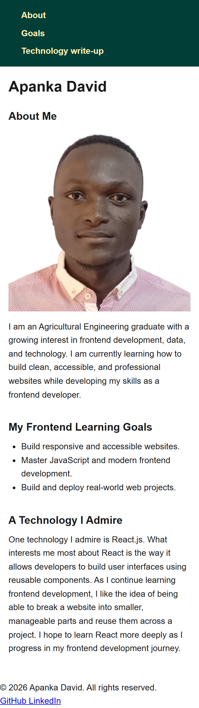
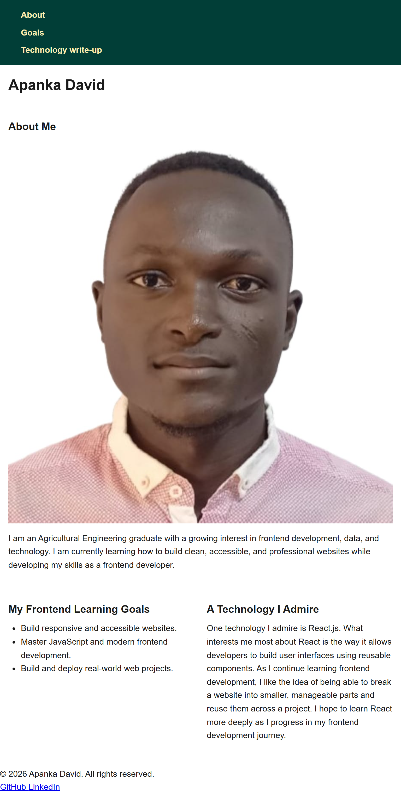
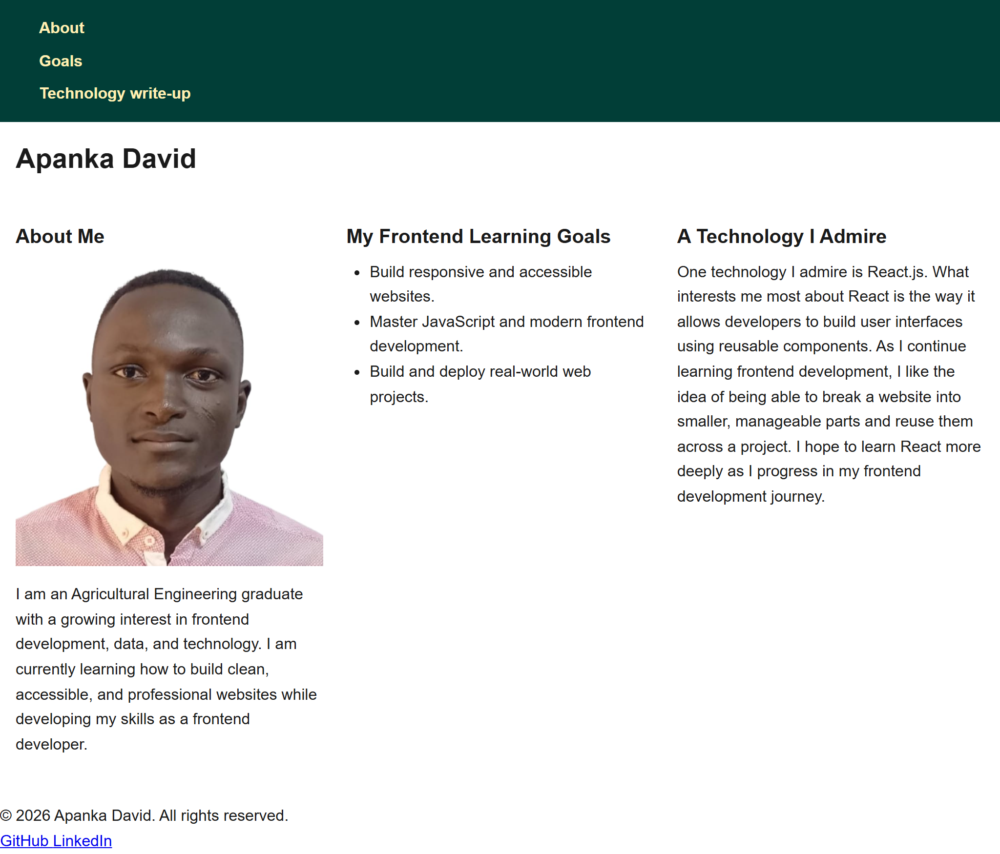

# Apanka David — Frontend Developer Portfolio

A responsive personal profile page built with semantic HTML5 and mobile-first CSS.

## Live Site

[https://apankadavid.github.io/week-1-profile/](https://apankadavid.github.io/week-1-profile/)

## Screenshots

### Mobile (375px)

### Tablet (768px)

### Desktop (1024px)

## Built With

- Semantic HTML5
- CSS Grid, Flexbox
- Mobile-first responsive design